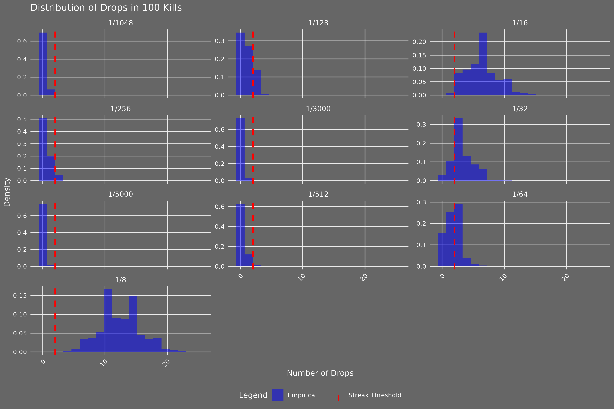
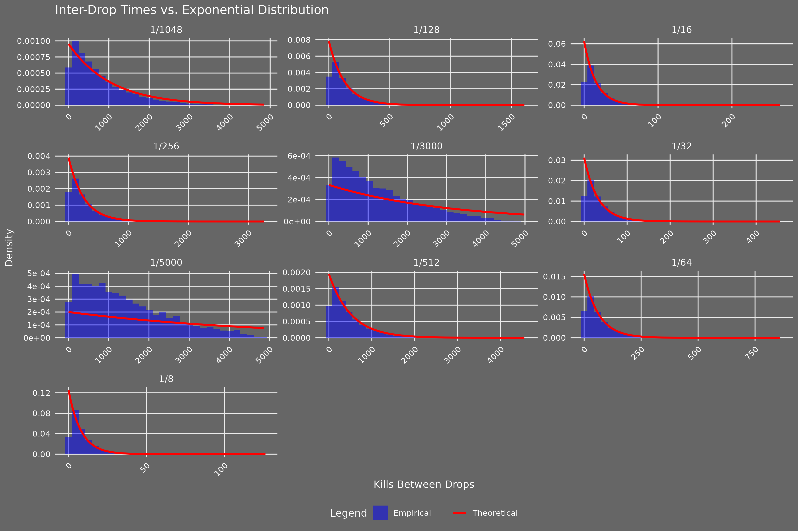

# OSRS Drop Rate Simulator
[](https://opensource.org/licenses/MIT)
[](https://www.r-project.org/)

This R project simulates rare item drop mechanics in Old School RuneScape (OSRS) to analyse kills to first drop, lucky streaks, and drop clustering for drop rates ranging from 1/8 to 1/5,000. Inspired by my passion for OSRS and statistical modelling, it quantifies community concepts like "getting spooned" (early drops) and "going dry" (late drops) while demonstrating advanced R programming, statistical analysis, and data visualisation skills. The methodology has applications beyond gaming, such as modelling rare events in manufacturing or finance. See [the project report](https://joshuaculbert.github.io/osrs-drop-rate-simulator/report.html) for a detailed analysis.

## Introduction

Old School RuneScape (OSRS) features rare item drops with probabilities like 1/128 or 1/5,000, leading to varied player experiences. This project, developed in March 2025, uses R to simulate these mechanics over 10,000 trials, providing statistical insights into:
- **Kills to First Drop**: How many kills are needed for the first success?
- **Lucky Streaks**: How likely are multiple drops in a 100-kill window?
- **Drop Clustering**: Are drops randomly distributed, or do they cluster?

The project showcases my expertise in probability distributions, hypothesis testing, and ggplot2 visualisations, making it a key part of my data analysis portfolio.

## Repository Contents
- `osrs_drop_rate_simulator.R`: R script for simulations and visualisations.
- `report.Rmd`: R Markdown source for the report.
- `docs/report.html`: Knitted HTML report with detailed analysis (hosted on GitHub Pages).
- `figures/`: Directory containing plots (CDF, lucky streaks, inter-drop times).

## Setup

### Prerequisites
- **R**: Version 4.0.0 or higher (developed and tested in R 4.5.0)
- **Packages**: `ggplot2`, `knitr`, `rmarkdown`

### Installation
1. Clone the repository:
   ```bash
   git clone https://github.com/joshuaculbert/osrs-drop-rate-simulator.git
2. Install the required packages:
   ```R
   install.packages(c("ggplot2", "knitr", "rmarkdown"))
3. Ensure the `figures/` directory exists (automatically created by the script if missing).
4. Run the script and knit the report:
   ```R
   source("osrs_drop_rate_simulator.R")
   rmarkdown::render("report.Rmd")
   ```

### Running the Script
Run `osrs_drop_rate_simulator.R` in R or RStudio. The script generates:
- Three tables (`df_stats`, `df_streak_probs`, `df_clustering`)
- Three plots saved to `figures/` (CDF, lucky streaks, inter-drop times)

## Analysis

The simulation models OSRS drop mechanics using probability distributions:
- **Kills to First Drop**: The geometric distribution (`rgeom`) simulates the number of kills until the first drop. Statistics (mean, variance, IQR, outliers) are compared to theoretical values.
- **Lucky Streaks**: The binomial distribution (`rbinom`) simulates drops in a 100-kill window. Empirical and theoretical probabilities of 2+ drops are calculated using a Poisson approximation.
- **Drop Clustering**: Inter-drop times are tested against an exponential distribution using the Kolmogorov-Smirnov (KS) test to assess randomness. Dispersion indices (variance/mean of drop counts) are computed to evaluate a Poisson process.

Key features:
- **Simulation**: 10,000 trials, drop rates from 1/8 to 1/5,000, up to 5,000 kills for clustering.
- **Statistical Validation**: Compares simulated vs. theoretical metrics (e.g., \( \text{mean} = 1/p \) for geometric).
- **Visualisations**: ggplot2 plots (CDF, histograms) with log10 scales and faceting for clarity.
- **KS Test Note**: Discrete inter-drop times cause KS test ties, addressed with minimal jitter (0–1) and warning suppression. This does not affect conclusions (see Results).

## Results

### Statistical Summary
Compares simulated vs. theoretical metrics for kills to first drop:

| Drop Rate | Sim Mean | Theo Mean | Sim Outliers | Theo Outliers |
|-----------|----------|-----------|--------------|---------------|
| 1/8       | 7.92     | 8.00      | 461          | 464           |
| 1/128     | 128.43   | 128.00    | 490          | 481           |
| 1/5000    | 5033.09  | 5000.00   | 483          | 481           |

*Note*: Full table (`df_stats`) includes variances, IQRs, outlier thresholds (e.g., ~23 kills for 1/8, ~387 for 1/128), and all drop rates (1/8 to 1/5,000).

### Lucky Streaks
Probability of 2+ drops in a 100-kill window:

| Drop Rate | Empirical Prob | Theoretical Prob |
|-----------|----------------|------------------|
| 1/8       | 1.0000         | 0.9999           |
| 1/128     | 0.1878         | 0.1845           |
| 1/5000    | 0.0001         | 0.0002           |

*Note*: Empirical and theoretical probabilities align closely, confirming simulation accuracy.

### Drop Clustering
Dispersion indices (~1, e.g., 1.03 for 1/128) support approximately exponential inter-drop times, indicating randomness:

| Drop Rate | KS p-value | Dispersion Index |
|-----------|------------|------------------|
| 1/8       | < 0.01     | 0.93             |
| 1/128     | < 0.01     | 1.03             |
| 1/5000    | < 0.01     | 1.00             |

*Note*: Small KS p-values (< 0.01) are due to large sample sizes (10,000 trials) detecting minor deviations from a continuous exponential distribution. Jitter (0–1) was added to break ties in discrete data, with warnings suppressed as they do not impact results.

### Visualisations
- **CDF Plot**: Empirical vs. theoretical cumulative distribution of kills to first drop (log10 scale).  
  
- **Lucky Streaks**: Histogram of drops in a 100-kill window, with a threshold at 2 drops.  
  
- **Inter-Drop Times**: Faceted histograms of inter-drop times vs. theoretical exponential distribution.  
  

## Key Findings
- **Kills to First Drop**: Simulated means (e.g., 7.92 for 1/8) and outliers closely match theoretical geometric distribution values.
- **Lucky Streaks**: Probabilities of 2+ drops in a 100-kill window (e.g., 18.78% for 1/128) align with Poisson-based expectations.
- **Drop Clustering**: Dispersion indices (~1) support approximately exponential inter-drop times, indicating drops are random with no clustering.
- **Outlier Experience**: Players "going dry" (e.g., needing ~3x the drop rate, such as ~387 kills for 1/128) are outliers, occurring in ~1/20 players per drop. With many drops in OSRS, most players will experience this "unlucky" outlier status for some item, aligning with community discussions on platforms like the 2007scape subreddit. See [the project report](https://joshuaculbert.github.io/osrs-drop-rate-simulator/report.html) for details.

These results quantify OSRS player experiences (e.g., "getting spooned" as early drops within the geometric distribution) and provide a robust statistical framework for rare event analysis.

## License

MIT License