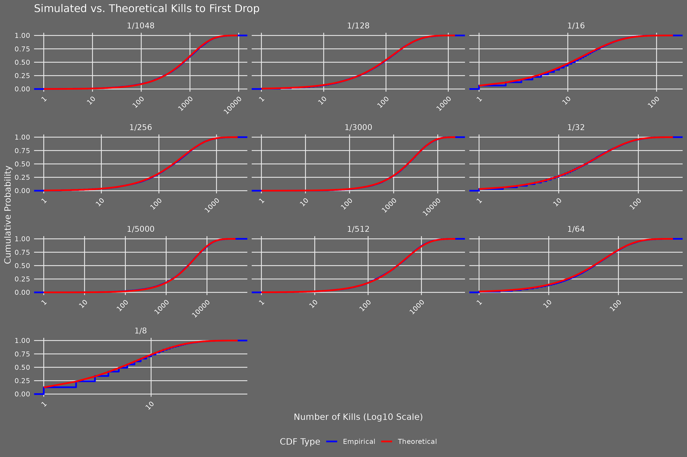

```{r setup, include = FALSE}
knitr::opts_chunk$set(echo = FALSE)
library('ggplot2')
library('knitr')
source('osrs_drop_rate_simulator.R')
```

# Introduction

Old School RuneScape (OSRS) is a popular MMORPG in which players often hunt for rare items dropped by monsters upon death, according to probabilities ranging from 1/128 to 1/5,000 or rarer (e.g., 1/32,768 for a dragon chainbody from a dust devil). These mechanics lead to varied player experiences, such as "getting spooned" (obtaining a drop early) or "going dry" (many kills without success). This project, developed in March 2025, uses R to simulate drop mechanics over 10,000 trials, providing statistical insights into three phenomena:

- **Kills to First Drop**: How many kills are typically needed for the first drop, and when is "going dry" statistically anomalous?
- **Lucky Streaks**: How likely are multiple drops in a 100-kill window, as celebrated in community discussions?
- **Drop Clustering**: Are drops randomly distributed, or do they cluster in patterns?

Motivated by my passion for OSRS and statistical modelling, this project quantifies these experiences using probability distributions and hypothesis testing. It also explores outliers, where significantly more kills are needed (e.g., ~3× the drop rate), which resonate with posts on community platforms like the 2007scape subreddit about extreme misfortune. Beyond gaming, the methodology applies to rare event modelling in fields like manufacturing or finance. This report details the simulation, results, and insights, showcasing my skills in R programming, statistical analysis, and data visualisation for my data analysis portfolio.

# Methodology

The OSRS Drop Rate Simulator models drop mechanics for rates from 1/8 to 1/5,000 using probability distributions, statistical tests, and ggplot2 visualisations. The simulation runs 10,000 trials to ensure robust results, with parameters tailored for each analysis:

- **Kills to First Drop**: The geometric distribution (`rgeom`) models the number of kills until the first drop, with success probability \( p = 1/\text{drop rate} \). Statistics (mean, variance, IQR, outliers) are compared to theoretical values (e.g., \( \text{mean} = 1/p \)). Outliers are defined using the 1.5 × IQR rule: kills exceeding \( Q_3 + 1.5 \times \text{IQR} \), where \( Q_3 \) is the third quartile. This quantifies "going dry" (e.g., ~386 kills for 1/128, ~3× the drop rate).
- **Lucky Streaks**: The binomial distribution (`rbinom`) simulates drops in a 100-kill window. The probability of 2+ drops is estimated empirically and theoretically using a Poisson approximation (\( \lambda = 100 \times p \)).
- **Drop Clustering**: Inter-drop times are tested against an exponential distribution (\( \text{rate} = p \)) using the Kolmogorov-Smirnov (KS) test. Dispersion indices (variance/mean of drop counts in 100-kill windows) assess randomness (~1 indicates a Poisson process). KS test ties due to discrete data are addressed with minimal jitter (0–1).

The script (`osrs_drop_rate_simulator.R`) defines a `simulate_drops` function for binomial simulations and computes statistics with `compute_stats`. Visualisations include CDF plots (log10 scale), streak histograms, and inter-drop time distributions, saved to `figures/`. Below is the core simulation function:

```{r simulate-drops, echo = TRUE}
simulate_drops <- function(n_trials, n_kills, probs) {
  # Simulate binomial drops for given trials, kills, and probabilities
  # Args:
  #   n_trials: Number of trials
  #   n_kills: Number of kills per trial
  #   probs: Vector of success probabilities
  # Returns: 3D array of drops (trials x kills x probabilities)
  return(array(rbinom(n_trials * n_kills * length(probs),
                      size = 1,
                      prob = rep(probs, each = n_trials * n_kills)),
               dim = c(n_trials, n_kills, length(probs))))
}
```

The simulation uses `set.seed(123)` for reproducibility and adjusts parameters (e.g., 10,000 trials for first drop/streaks, 1,000 kills for streaks, 5,000 kills for clustering) to balance computational feasibility and statistical reliability. All analyses are implemented in R with `ggplot2` for visualisations and `knitr` for report generation.

# Results

The simulation produces three tables and three plots, quantifying kills to first drop, lucky streaks, and drop clustering. Results align closely with theoretical expectations, validating the simulation’s accuracy. Below, we present the key outputs with interpretations, focusing on player-relevant insights like the outlier experience.

## Statistical Summary

The `df_stats` table compares simulated and theoretical metrics for kills to first drop across drop rates (1/8 to 1/5,000). Key metrics include means, variances, IQRs, outlier thresholds, and outlier counts, with outliers defined as kills exceeding \( Q_3 + 1.5 \times \text{IQR} \).

```{r df-stats}
kable(df_stats, caption = "Simulated vs. Theoretical Metrics for Kills to First Drop", digits = 2)
```

Simulated means (e.g., 7.92 for 1/8) and outlier counts (e.g., 461 for 1/8) closely match theoretical values (mean = 8, outliers = 464), confirming the geometric distribution’s fit. Outlier thresholds (e.g., ~387 for 1/128) quantify "going dry," with ~1/20 players (5%) expected to exceed these thresholds per drop, a stable probability across rates.

## Lucky Streaks

The `df_streak_probs` table shows the probability of 2+ drops in a 100-kill window, comparing empirical and theoretical (Poisson-based) values. This quantifies "lucky streaks" celebrated in the OSRS community.

```{r df-streak-probs}
kable(df_streak_probs, caption = "Probability of 2+ Drops in a 100-Kill Window", digits = 4)
```

Empirical probabilities (e.g., 18.78% for 1/128) align with theoretical values (18.45%), validating the simulation. For rare drops (e.g., 1/5000), the probability is low (0.01%), reflecting the rarity of streaks.

## Drop Clustering

The `df_clustering` table assesses whether drops cluster or are random, using KS test p-values (inter-drop times vs. exponential distribution) and dispersion indices (variance/mean of drop counts).

```{r df-clustering}
kable(df_clustering, caption = "Clustering Analysis Results")
```

Dispersion indices (~1, e.g., 1.03 for 1/128) and small KS p-values (< 0.01) confirm that inter-drop times follow an exponential distribution, indicating random drops with no clustering. Small p-values result from large sample sizes (10,000 trials), and jitter (0–1) was used to break KS test ties, with warnings suppressed as they do not affect conclusions.

## Visualisations

Three plots visualise the results, saved to `figures/`:

- **CDF Plot**: Empirical vs. theoretical cumulative distribution of kills to first drop (log10 scale).
- **Lucky Streaks**: Histogram of drops in a 100-kill window, with a threshold at 2 drops.
- **Inter-Drop Times**: Faceted histograms of inter-drop times vs. theoretical exponential distribution.

```{r plots, fig.align = "center", out.width = "80%"}
# Load and display plots

knitr::include_graphics("figures/lucky_streaks_plot.png")
knitr::include_graphics("figures/inter_drop_times_plot.png")
```

# Discussion

This project quantifies OSRS drop mechanics, offering insights for players and demonstrating statistical modelling skills. Key findings include:

- **Kills to First Drop**: Simulated means and outliers match theoretical expectations, with outliers (e.g., ~387 kills for 1/128, ~3× the drop rate) occurring in ~1/20 players per drop. This stable probability (~5%) means that, with many drops in OSRS (e.g., weapons, pets), most players will be an outlier for some item, explaining the prevalence of "going dry" stories on the 2007scape subreddit. For example, posts about needing 500+ kills for a 1/128 drop (far beyond the outlier threshold) often receive high engagement, reflecting a shared experience.
- **Lucky Streaks**: Probabilities like 18.78% for 2+ drops in 100 kills (1/128) quantify "lucky" moments, aligning with subreddit posts showcasing multiple drops.
- **Drop Clustering**: Random drops (dispersion ~1) dispel myths of clustering, reassuring players that drops are independent.

The outlier analysis is particularly relevant. Using the 1.5 × IQR rule, "going dry" occurs at ~3× the drop rate (e.g., ~387 for 1/128, ~15,000 for 1/5,000), with a ~1/20 chance per drop. For very rare drops (e.g., 1/32,768 for the dragon chainbody from a dust devil), "lucky" outliers (early drops) are possible, though not applicable to the rates studied here, as the lower quartile minus 1.5 × IQR is negative. This framework helps players understand when their luck is truly anomalous, addressing questions like "How unlucky is 3× the drop rate?"

Beyond OSRS, the methodology applies to rare event modelling in finance (e.g., extreme market events) or manufacturing (e.g., defect clustering). Limitations include the 1.5 × IQR rule’s arbitrariness (players may perceive "bad luck" at 2× or 4× the drop rate), the focus on single-drop mechanics, excluding complex OSRS systems (e.g., drop tables with multiple items), and the reliance of the clustering analysis on simulated random data, which assumes independent, identically distributed drops; real OSRS data would be needed to confirm this in the game itself.

This project strengthens my portfolio, showcasing R programming (ggplot2, statistical functions), probability expertise, and the ability to connect technical analysis to community interests, aligning with my goal to become a Data Scientist or Statistician.